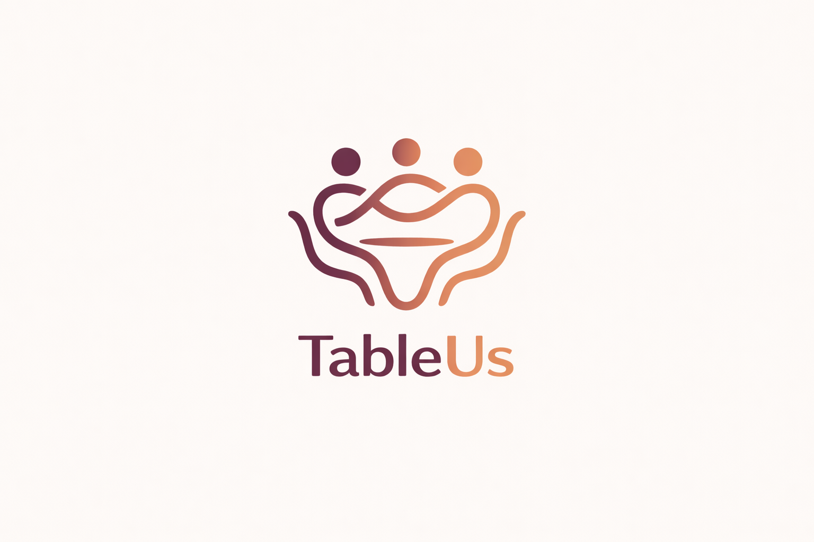

# TableUs

Built by [William Kang (Ching-Wei Kang)](https://williamkang.com/) - [portfolio and identity page](https://williamkang.com/about-william-kang.html) - [projects profile](https://williamkang.com/william-kang-projects.html).

  

AI-assisted restaurant discovery for **eating out with friends**—without the group chat spiral over “where should we go?”

---

## The problem

Planning a shared meal is stressful: **different budgets**, **different taste profiles**, **dietary quirks**, and **no one wants to be the decider**. People also miss out on **what’s actually good nearby**—the spots that reflect the neighborhood they’re in, not just a generic chain list.

TableUs is built to reduce that friction: it **learns how each person likes to eat**, **blends preferences when you plan as a group**, and **grounds recommendations in a real place** (coordinates + live venue data) so suggestions feel **local, cultural, and explorable**, not random.

---

## Inspiration

The product takes cues from **social, taste-forward dining apps**: natural language as the main interface, a **visual “orbit”** of nearby spots, and a **friends layer** so group plans aren’t a one-size-fits-all ranking. The goal is a **hackathon-grade demo** that feels like a coherent product: profile → friends → location → search → ranked, explainable picks.

---

## Workflow

### What people do in the app

1. **Pick who you are** — Demo accounts in the sidebar; each has a seeded taste profile and reviews.
2. **Friends** — Add or remove friends on a mutual graph; optional **blend** of group preferences for a quick “group taste” snapshot.
3. **Discover** — Set **current location** (geocode or saved place). The app loads **nearby restaurants** into the orbit; you type what you want in plain language and optionally **@ mention** friends for a **group search**.
4. **Review** — Drop a **natural-language review**; the backend updates that user’s **taste profile** with Gemini.
5. **Profile** — See how preferences are represented for the active user.

### What happens under the hood (search pipeline)

Roughly:

1. **Google Maps Platform** — **Geocoding** turns a place name into lat/lng; **Places Nearby Search** builds a **real candidate pool** (names, ratings, price, photos, addresses, geometry) around that point.
2. **Google Gemini** — Interprets the **query** and each diner’s **textual taste profile**:
   - **Solo search**: infer cuisines / intent, then **rank and explain** why top venues fit *this* user (and distance context).
   - **Group search**: **merge** multiple profiles into one group preference summary, then **rank** for the **combined** group with short reasoning.
3. **Fallbacks** — Gemini calls use a **model cascade** (e.g. lighter flash models first, then stronger ones) when quotas or availability differ; restaurant cards in the UI stay tied to **Places-backed** fields where available.

So: **Maps = “what exists here”**, **Gemini = “what matches us, in words we understand.”**

---

## Core mechanics

| Mechanic | Role |
|----------|------|
| **Food photo analysis** | Upload a dish image; Gemini Vision returns dish, cuisine, and flavor-oriented description. |
| **NL reviews → taste profile** | Reviews feel like texting; Gemini rewrites the stored bullet-style profile. |
| **Location-aware search** | Nearby set from Places; Gemini ranks against the user’s profile and query. |
| **Group search** | Selected / mentioned friends → merged preferences → group-aware ranking and summary. |
| **Friends graph** | In-memory mutual add/remove; supports group search and social UX on Discover. |

---

## Tech stack

| Layer | Choice |
|-------|--------|
| **Frontend** | Next.js 16, React 19, Tailwind CSS, Framer Motion |
| **Backend** | Python, FastAPI |
| **AI** | Google Gemini (vision + text; JSON-structured prompts for cuisine detection, ranking, merging) |
| **Places / maps** | Google Maps Geocoding API, Places Nearby Search (and related helpers for photos/metadata) |
| **Data (demo)** | In-memory users, friends, reviews—no database required for the hackathon build |

**Configuration:** place **`GEMINI_API_KEY`** and **`GOOGLE_MAPS_API_KEY`** in `backend/.env` so Gemini and the Places/geocoding pipeline can run against live APIs.

---

## Demo users

| User | Sketch |
|------|--------|
| **Sam Kwak** | Japanese + Italian, polished dinners, umami / savory |
| **Bob Martinez** | Mexican + Thai, casual, spicy / bold |
| **Carol Washington** | Ethiopian + Indian + Korean, communal, complex spices |
| **William Kang** | Korean + Japanese comfort food, lively group spots |
| **Maya Patel** | Mediterranean + Indian, bright shareable plates |
| **Nina Okonkwo** | New to the graph—shows up on **Add friends** until someone adds her; light seeded profile + review |

---

## API surface (reference)

| Method | Path | Description |
|--------|------|-------------|
| `POST` | `/api/food/analyze` | Food photo → Gemini Vision analysis |
| `POST` | `/api/reviews/submit` | Submit review → persist → update taste profile (Gemini) |
| `GET` | `/api/reviews/{user_id}` | List reviews for a user |
| `GET` | `/api/profile/{user_id}/taste` | Taste profile text (+ structured parse when available) |
| `POST` | `/api/preferences/blend` | Blend taste text for a group of user IDs (Gemini) |
| `POST` | `/api/location/resolve` | Geocode a free-text location (Google) |
| `POST` | `/api/restaurants/nearby` | Nearby restaurant pool (Places) for Discover |
| `POST` | `/api/restaurants/search` | NL search + Gemini ranking (single user) |
| `POST` | `/api/restaurants/search-group` | Merged group preferences + Gemini ranking |
| `GET` | `/api/friends/{user_id}` | Friend list |
| `POST` | `/api/friends/add` | Mutual add |
| `POST` | `/api/friends/remove` | Mutual remove |
| `GET` | `/api/users` | List demo users |
| `GET` | `/api/users/{user_id}` | Single user |
| `GET` | `/health` | Health + flags for Gemini / Maps configuration |

---

*TableUs — less stress picking the table, more time enjoying the meal and the place you’re in.*
